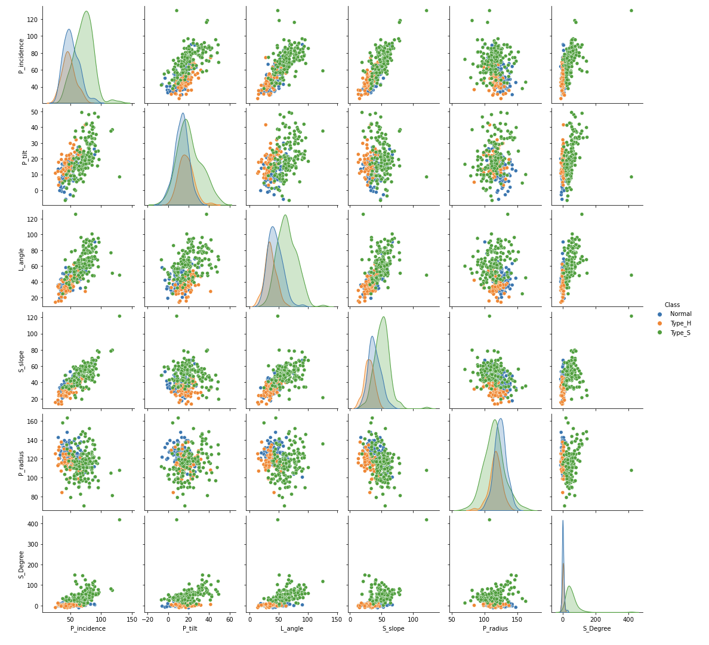
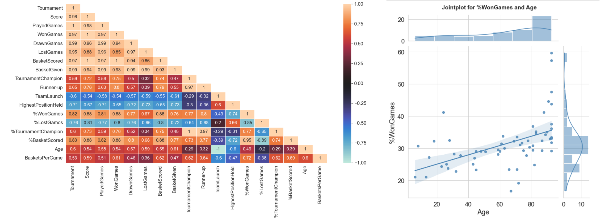

# Academic Projects

{: style="width:300px; "}
 
<u><a href="https://eportfolio.mygreatlearning.com/abhinandita-dash" target="_blank" >Academic e-portfolio</a></u>  

???+ abstract "Computer Vision: Pneumonia_ Detection from X-ray images &nbsp;&nbsp;&nbsp;&nbsp;[:simple-github:](https://github.com/dash-abhinandita/Pneumonia_Detection){target="_blank"}"
    {: style="width:200px; "; align=left }  The project comprises of **26,684 X-ray images** classified as Normal, Lung Opacity and No Lung Opacity/ Not normal. The objective is to design and develop an **object detection model** to classify patients suffering from Pneumonia and **predict its bounding boxes**.   
    **ML libraries/Architectures**: TensorFlow, CNN, R-CNN, YOLOv8, Transfer learning (VGG16, ResNET50)

???+ abstract "Develop NLP-based classifier to predict the blog topic &nbsp;&nbsp;&nbsp;&nbsp;[:simple-github:](https://github.com/dash-abhinandita/Blog_topic_classifier){target="_blank"}"
    {: style="width:200px; "; align=left }   Blogs, posts, articles, etc. are published constantly by various authors in different **genres**. This blog authorship corpus dataset comprises of **681,288 posts** from **19,320 bloggers**. Given a text, the task is to create a multi label classifier that could predict the topic the blogger intends to write without knowing about him/her. 
    **ML libraries/Architectures**: NLTK, Gensim (Word2Vec), Scikit-learn (CountVectorizer, TfidfVectorizer), TensorFlow, Keras, MultinomialNB, RandomForestClassifier, Embedding, LSTM  

???+ abstract "Design a semi-rule based chatbot using NLP &nbsp;&nbsp;&nbsp;&nbsp;[:simple-github:](https://github.com/dash-abhinandita/ChatBot){target="_blank"}"
    {: style="width:200px; "; align=left }   
    Great Learning has a an **academic support department** which receives numerous support requests every day throughout the year. Based on a sample corpus(and using our linguistics skills), designed and developed an interactive ML/DL semi - rule based chatbot which can interact with the user, understand the problem and display the resolution procedure for generic request or redirect the request.  
    **ML libraries/Architectures**: NLTK, Scikit-learn (CountVectorizer), TensorFlow (Tokenizer), Keras, Neural Network 

???+ abstract "Implement face recognition model &nbsp;&nbsp;&nbsp;&nbsp;[:simple-github:](https://github.com/dash-abhinandita/Face_Recognition){target="_blank"}"
     {: style="width:200px; "; align=left }   The Face Aligned Face Dataset from Pinterest contains **10,770** images for **100 people**. So the objective is to implement a face recognition model for a company, which intends to recognize celebrity faces from images. Generated an embeddings vector on each face in the dataset and built a classifier in order to map each image to its right person.  
     **ML libraries/Architectures**: TensorFlow, Scikit-learn, Convolutional Neural network

???+ abstract "Image classifier to detect plant and flower species &nbsp;&nbsp;&nbsp;&nbsp;[:simple-github:](https://github.com/dash-abhinandita/Image_classifier){target="_blank"}"
    {: style="width:200px; "; align=left }   
     University is doing research to understand the characteristics of plant and plant seedlings at various stages of growth and also the characteristics of flowers. Their dataset comprises of 4750 images from **12 plant species** and 1360 images from **17 flower categories**  (OxFlower dataset). The objective is to create a classifier that can determine plant's and flower's species from an image. The task was accomplished by developing multiple models (CNN, transfer learning, hyper-parameter tuning, image augmentation) and then selecting the best model capable of classifying the plant's species and flower species.  
     **ML libraries/Architectures**: TensorFlow, Scikit-learn, Neural Network, Convolutional Neural Network, Transfer learning (VGG16), ImageDataGenerator

???+ abstract "Digit classifier on the SVHN (Street View Housing Number) dataset &nbsp;&nbsp;&nbsp;&nbsp;[:simple-github:](https://github.com/dash-abhinandita/Digit_classifier){target="_blank"}"
      {: style="width:200px; "; align=left }   
      The SVHN is a real-world image dataset comprising over **600,000** digit images for developing machine learning and object recognition algorithms. The variability in the visual appearance of text is due to range of fonts, colours, styles, orientations, and character arrangements. The recognition problem is complicated by environmental factors such as lighting, shadows, specularity, and occlusions as well as by image acquisition factors such as resolution, motion, and focus blurs. In this project, the objective is to build a digit classifier which can predict the multi-digit numbers in the photographs captured at street level from a subset of data over **100,000**.  
      **ML libraries/Architectures**: TensorFlow, Scikit-learn, Keras, Neural network

???+ abstract "Develop smartphone recommendation system &nbsp;&nbsp;&nbsp;&nbsp;[:simple-github:](https://github.com/dash-abhinandita/Smartphone_recommendation_system){target="_blank"}"
    {: style="width:200px; "; align=left }   
    This project replicates a real time use case of an e-commerce company, which can recommend mobile phones to a user, which are most popular and personalized respectively. The project was accomplished by employing **recommendation techniques** such as popularity-based recommendation and collaborative filtering methods to recommend a mobile handset to its users based on the individual consumer’s behavior/choices.  
    **ML libraries**: Surprise (SVD, KNNWithMeans,GridSearchCV)

???+ abstract "Build classifier to predict the yield in a semiconductor manufacturing company &nbsp;&nbsp;&nbsp;&nbsp;[:simple-github:](https://github.com/dash-abhinandita/Yield_in_a_semiconductor_manufacturing){target="_blank"}"
    {: style="width:200px; "; align=left }   
    A semiconductor manufacturing company has sensor data comprising of **1567 datapoints** with **591 features**. Identification of the yield of manufacturing process using these many features is time consuming and may incur significant loss if gone wrong. The goal of the project was to determine key factors contributing to yield excursions downstream in the process and will enable an increase in process throughput, decreased time to learn and reduce per-unit production costs. The project was accomplished by employing supervised learning, ensemble modeling, and unsupervised learning techniques to build and train a prediction model to identify **Pass/Fail yield** of a particular process entity for a semiconductor manufacturing company.  
    **ML Techniques**: KNeighborsClassifier, LogisticRegression, GaussianNB, SVC, DecisionTreeClassifier, RandomForestClassifier, PCA

???+ abstract "Develop a ML model to address customer churn issue &nbsp;&nbsp;&nbsp;&nbsp;[:simple-github:](https://github.com/dash-abhinandita/Predict_customer_churn){target="_blank"}"
    {: style="width:200px; "; align=left }   
    This project is based on a telecommunication company which is facing a **customer churn** issue. The project aims at understanding the pattern of the data and predicting customers who are going to churn based on multiple variables to help the company in retaining their existing customers. The project was accomplished by building a machine learning model that will help identify potential customers who have a high probability to churn.  
    **ML Techniques**: XGBoost

???+ abstract "Classification of orthopedic patients based on biomechanical features &nbsp;&nbsp;&nbsp;&nbsp;[:simple-github:](https://github.com/dash-abhinandita/Orthopedic_patient_classifier){target="_blank"}"
    {: style="width:200px; "; align=left }   
     Medical research university is undergoing a deep research on patients with certain conditions. The objective is to classify orthopedic patients belonging to one out of three categories: Normal **(100 patients)**, Disk Hernia **(60 patients)** or Spondylolisthesis **(150 patients)**. The patient's condition is analysed based on biomechanical features, which includes (pelvic incidence, pelvic tilt, lumbar lordosis angle, sacral slope, pelvic radius, grade of spondylolisthesis).  
     **ML Techniques**: KNeighborsClassifier, LogisticRegression  

???+ abstract "Recommend basketball team using statistical analysis &nbsp;&nbsp;&nbsp;&nbsp;[:simple-github:](https://github.com/dash-abhinandita/Exploratory_data_analysis){target="_blank"}"
    {: style="width:200px; "; align=left }  
    A company wants to invest on proposals on managing some of the best teams in the league. Hence the company wants to understand, which teams they can approach, which will be a deal win for them. In this project, past tournament information was analysed to make informative decisions. **Statistical and visualisation** techniques such as histograms, barcharts, piecharts, heatmap, pair-wise scatterplot, joint-plot, box-plot etc are used to perform exploratory data analysis and come up with performance metrics to help in decision making.  
    **ML libraries**: Pandas, NumPy, Seaborn, Matplotlib, SciPy